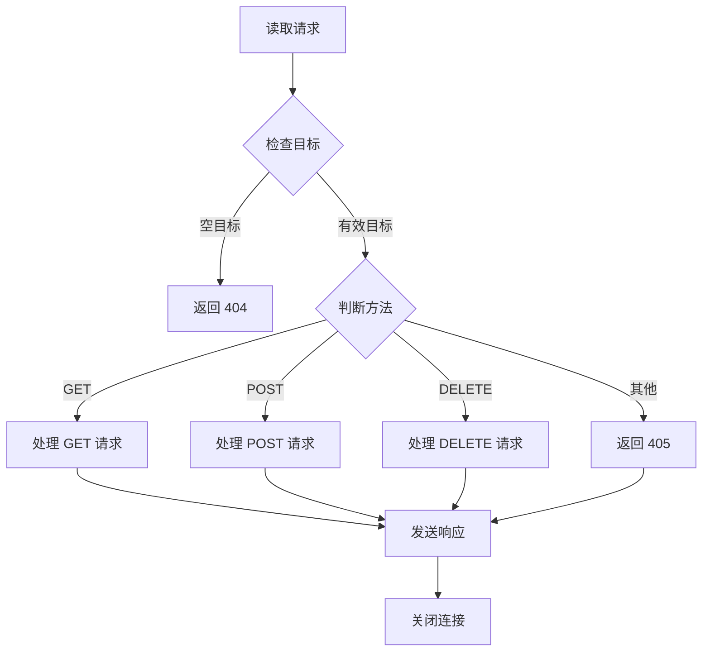

# BwtFS Net 开发文档

本文档面向 BwtFS Net 子项目的开发者，详细说明项目的架构设计、实现细节和开发指南。

## 项目架构

### 目录结构

```
net/
├── CMakeLists.txt      # 构建配置
├── main.cpp           # 程序入口和服务器初始化
└── server.hpp         # HTTP 服务器完整实现
```

### 核心组件

#### 1. 主程序 (main.cpp)

- **功能**：服务器启动、配置加载、BwtFS 系统初始化
- **关键函数**：
  - `http_server()`：异步 TCP 接受器，处理连接
  - `main()`：初始化配置、打开 BwtFS、启动 HTTP 服务器

#### 2. HTTP 服务器 (server.hpp)

- **设计模式**：单文件实现，包含完整的 HTTP 服务器逻辑
- **核心类**：`http_connection` - 管理单个 HTTP 连接

## 核心类设计

### http_connection 类

```cpp
class http_connection : public std::enable_shared_from_this<http_connection> {
private:
    tcp::socket _socket;                                    // TCP 套接字
    static std::unordered_map<std::string, bw_tree*> _trees; // 活跃的文件上传映射
    beast::flat_buffer _buffer{1024*1024*10};               // 10MB 缓冲区
    http::request_parser<http::dynamic_body> _request;      // HTTP 请求解析器
    http::response<http::dynamic_body> _response;           // HTTP 响应
    bool is_finished = false;                               // 请求完成标志
};
```

#### 生命周期管理

1. **创建**：`std::make_shared<http_connection>(std::move(*socket))`
2. **启动**：调用 `start()` 方法开始读取请求
3. **处理**：异步读取 → 处理 → 响应
4. **销毁**：响应完成后自动释放

#### 请求处理流程



## API 实现细节

### 1. GET 请求处理

#### 文件下载 (`/{token}`)

```cpp
// Token 验证
if (token.size() < 30) {
    // 无效 Token
    return error_response;
}

// 从 BwtFS 查找文件
auto node = BwtFS::Node::readNodeByToken(token);
if (!node) {
    // 文件不存在
    return not_found;
}

// 流式发送文件（4KB 块）
auto file_size = node->getNodeSize();
auto chunk_size = std::min(4096UL, file_size - offset);
```

#### Web 界面 (`/`)

- 内嵌 HTML/CSS/JavaScript（约 400+ 行）
- 响应式设计，支持移动端
- AJAX 异步操作，无需页面刷新

### 2. POST 请求处理

#### 文件上传 (`/upload`)

```cpp
// 分块上传处理
auto file_id = extract_file_id_from_request();
if (file_id.empty()) {
    // 首次上传，创建新文件
    file_id = generate_unique_id();
    _trees[file_id] = new BwtFS::Node::bw_tree();
}

// 追加数据块
_trees[file_id]->insert(offset, data);

// 检查是否完成
if (is_upload_complete(file_id)) {
    // 完成，生成 Token
    auto token = BwtFS::Node::newNode(_trees[file_id]);
    _trees.erase(file_id);
}
```

### 3. DELETE 请求处理

```cpp
// Token 验证和文件删除
auto node = BwtFS::Node::readNodeByToken(token);
if (node && BwtFS::Node::deleteNode(token)) {
    // 删除成功
    return success_response;
}
```

## 关键设计决策

### 1. 异步 I/O 模型

- **选择**：httplib.h 内置异步模型
- **优势**：高并发、低资源消耗
- **实现**：每个连接独立处理，避免阻塞

### 2. 内存管理

- **缓冲区**：10MB 固定大小缓冲区
- **分块传输**：1MB 上传块，4KB 下载块
- **智能指针**：`shared_ptr` 管理连接生命周期

### 3. Token 系统

- **生成**：BwtFS 自动生成 30+ 字符唯一 Token
- **存储**：全局映射表 `_trees` 管理上传中的文件
- **安全**：Token 不可预测，防止枚举攻击

## 性能优化

### 1. 连接管理

```cpp
// 短连接策略（除 POST 外）
_response.keep_alive(false);

// POST 使用长连接支持分块上传
if (_request.get().method() == http::verb::post) {
    _response.keep_alive(true);
}
```

### 2. 内存效率

- **大文件处理**：流式传输，避免全量加载到内存
- **缓冲区复用**：固定大小缓冲区，避免频繁分配
- **及时清理**：上传完成后立即清理临时数据

### 3. 错误处理

```cpp
// 分层错误处理
try {
    // 业务逻辑
} catch (const std::exception& e) {
    LOG_ERROR << "Exception: " << e.what();
    // 返回错误响应
} catch (...) {
    LOG_ERROR << "Unknown exception";
    // 返回通用错误
}
```

## 调试和日志

### 日志级别

- **DEBUG**：请求/响应详细信息
- **INFO**：服务器状态变化
- **WARN**：非致命错误
- **ERROR**：严重错误